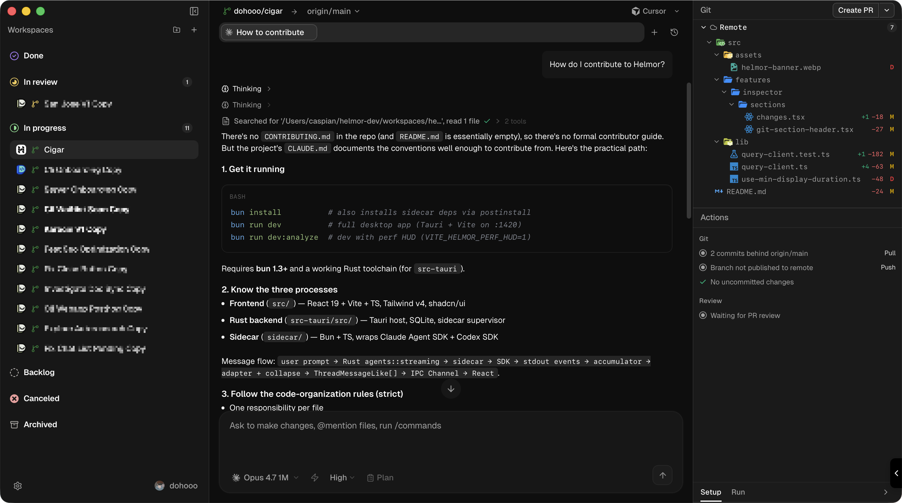

  

  

<h1 align="center">Helmor</h1>

  The local-first IDE for coding agent orchestration. 
  We're rethinking what a developer workflow looks like in the AI era — so every engineer can ship at 100x.

> _"AI made me 10x. **Helmor** takes me 100x. Goodbye, handcrafted code. 👋"_

## Install

  

[**Download for macOS, Windows &amp; Linux** →](https://github.com/dohooo/helmor/releases)

_macOS (stable) · Windows &amp; Linux (alpha) — vibe-coded, never tested. PRs welcome._

## Contributing

Open Helmor, Import Helmor, Ask Helmor:

> _"How do I contribute to Helmor?"_

That's the guide.

## License

[Apache 2.0](./LICENSE)
